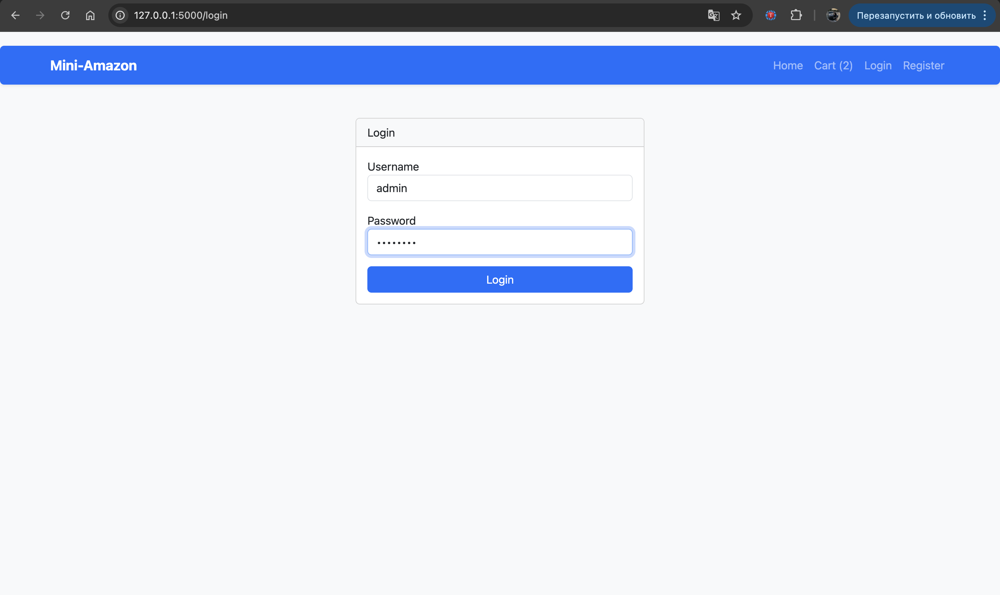
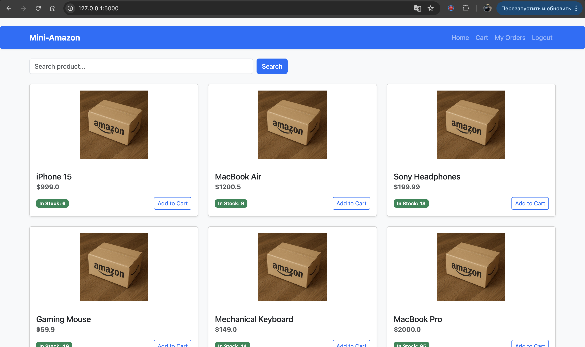
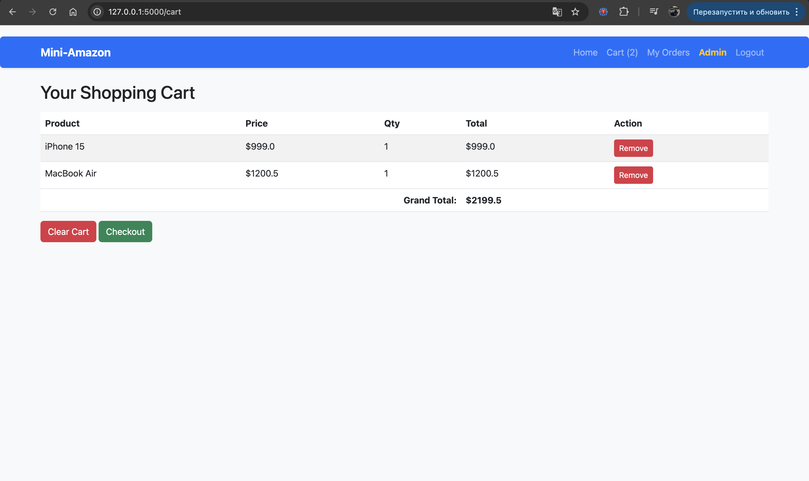
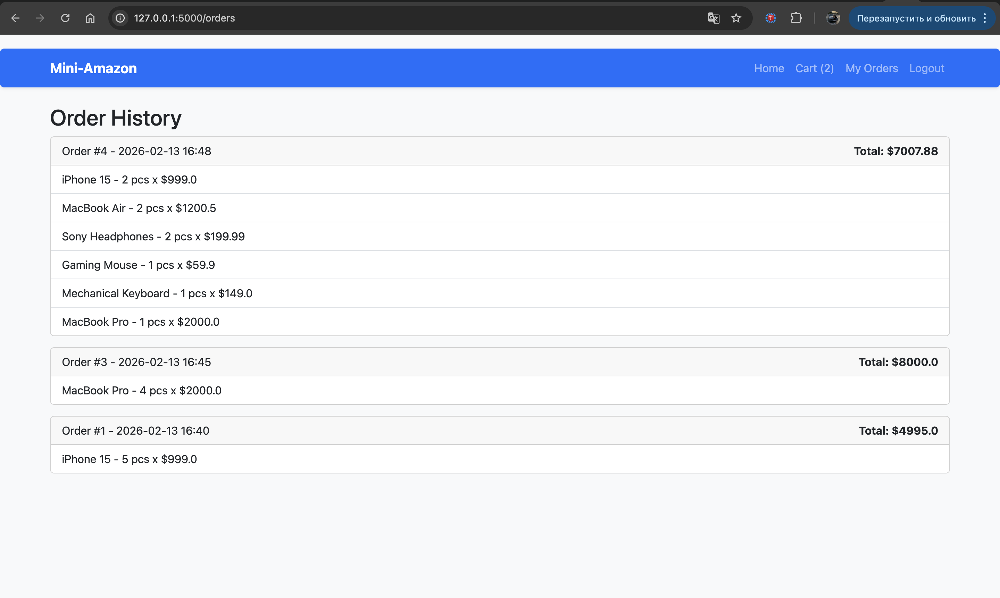
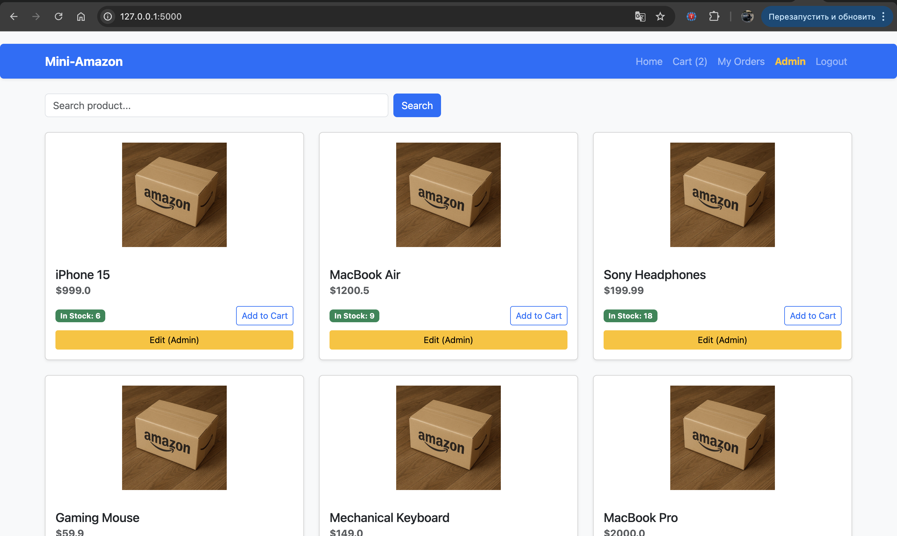
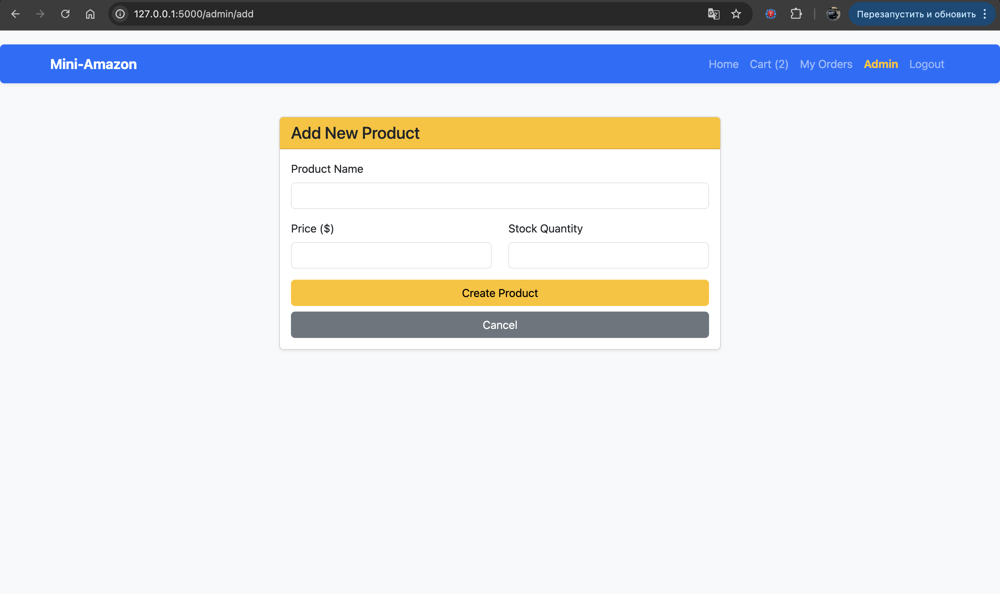

# Mini-Amazon E-Commerce System

This project is a functional e-commerce platform built with **Python** and **Flask**.
It simulates a simplified online store where users can browse products, manage a shopping cart, and place orders.

Instead of a basic console interface, this project implements a **Web Interface** (Bonus Requirement) to provide a more realistic user experience.

## 🚀 Features Implemented

### Core Requirements
1.  **User System:**
    * User Registration with unique username validation.
    * Secure Login/Logout system.
    * Session management (users can only see their own cart and orders).
2.  **Product Catalog:**
    * Browse all available products.
    * Search products by name (case-insensitive).
    * Stock validation (cannot add more items than available).
3.  **Shopping Cart:**
    * Add items to cart (with stock checks).
    * View cart with subtotal and grand total calculation.
    * Manage Items: Ability to remove specific items from the cart without clearing the entire selection.
    * Data persistence: Cart contents are saved in the database.
4.  **Checkout System:**
    * Re-validates stock before purchase.
    * Deducts stock from the database.
    * Saves the order to history.
    * Clears the cart after success.

### 🏆 Bonus Extensions Implemented
I have implemented **4 bonus features**:
1.  **Web Framework (Flask):** Replaced the console menu with a responsive Bootstrap UI.
2.  **SQLite Database:** Used instead of JSON files for reliable data storage (`SQLAlchemy`).
3.  **Password Hashing:** Passwords are hashed using `SHA-256` (Werkzeug security) before storage.
4.  **Admin Mode:** Special interface for adding and editing products.

---

## 🛠️ Technical Stack
* **Language:** Python 3
* **Framework:** Flask
* **Database:** SQLite (via SQLAlchemy)
* **Frontend:** HTML5 + Bootstrap 5
* **Architecture:** Modular design (`app.py`, `models.py`)

---

## ⚙️ How to Run

1.  **Install dependencies:**
    You need Flask and SQLAlchemy installed. Run:
    ```bash
    pip install -r requirements.txt
    ```

2.  **Run the application:**
    ```bash
    python app.py
    ```
    *The database `shop.db` will be created automatically on the first run.*

3.  **Open in Browser:**
    Go to: `http://127.0.0.1:5000`

---

## 🔑 Test Credentials

To test the **Admin features** (Add/Edit Products), use this account:
* **Username:** `admin`
* **Password:** `admin123`

To test **User features**, you can register a new account on the `/register` page.

---

## 📂 Project Structure

* `app.py`: Main application logic, routing, and controllers.
* `models.py`: Database models (User, Product, Order, OrderItem).
* `templates/`: HTML files for the user interface.
* `static/`: Images for the product catalog.
* `requirements.txt`: List of dependencies.

---

## ⚠️ Known Limitations
1.  **Images:** The project uses a static placeholder image for all products to keep the project simple. Real image uploading is not implemented.
2.  **Payment:** The checkout process simulates a purchase; no real payment gateway is connected.
3.  **Single Admin:** The system is designed for a single admin user created during initialization.
## 📸 Screenshots

### 1.  Login


### 2. User Catalog (Browsing)


### 3. Shopping Cart


### 4. Order History


### 5. Admin Mode (Bonus Feature)
*Note: Yellow "Edit" buttons appear only for Admin users.*


### 6. Product Management
